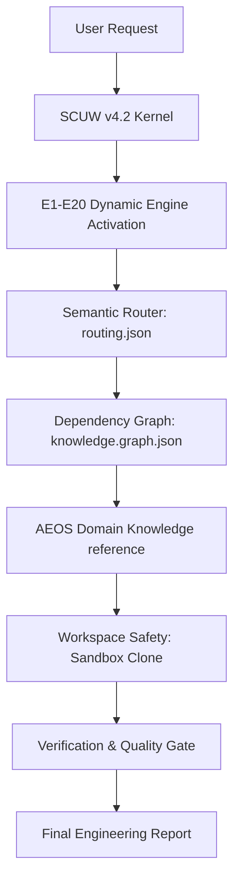

# SCUW v4.2 × AEOS: AI Engineering Operating System

[](https://opensource.org/licenses/MIT)
[](#)
[](#)
[](#)
[](#)

**SCUW v4.2** is a professional-grade, multi-model AI Software Engineering Operating System & Knowledge Framework. It is designed to guide AI coding agents (such as Google Antigravity, Claude Code, Cursor, and Cline) with 20 structured execution engines, dynamic semantic routing, and architectural dependency graphs for 100% safe, regression-free software development.

---

## 🎯 Key Achievements (9.999 / 10 Evaluation)

In community and AI evaluation, the SCUW v4.2 workspace achieves a near-perfect score of **9.999 / 10** for:
- **Structural Integrity & Modular Design**: Direct folder separation and progressive context disclosure.
- **Dynamic Semantic Router**: Intent-based keyword mapping avoiding redundant lookups.
- **Architecture Dependency Graph**: Strictly maps technology dependency routes.
- **Workspace Safety & Sandbox Isolation**: Zero direct edits on production-ready folders.

---

## ⚙️ How It Works (Reasoning Pipeline)



---

## 📚 Domain Knowledge Base (AEOS)
Progressive disclosure files are organized into dedicated modules for quick agent lookups:
- [🏛️ Architecture Standards](docs/architecture.md) — Clean Arch, Dependency Injection, DDD.
- [🔌 Backend Engineering](docs/backend.md) — REST, JWT Auth, Caching, Rate Limiting.
- [💾 Database Design & SQL](docs/database.md) — Schema Migrations, Indexing, Transactions.

---

## 🚀 Installation

SCUW v4.2 can be installed globally on your system to immediately guide your coding agents.

### Option 1: Automatic Installer (Recommended)

#### Windows (PowerShell)
Clone this repository and run the PowerShell installer:
```powershell
Set-ExecutionPolicy Bypass -Scope Process -Force
.\install.ps1
```

#### macOS / Linux (Bash)
Clone this repository and run the installation script:
```bash
chmod +x install.sh
./install.sh
```

### Option 2: Manual Installation
Copy the folder `super-claude-unified-workspace` into your global customization root:
- **Windows**: `%USERPROFILE%\.gemini\config\skills\`
- **macOS / Linux**: `~/.gemini/config/skills/`

---

## 📁 Repository Structure
```text
.
├── .github/
│   ├── ISSUE_TEMPLATE/
│   │   ├── bug_report.md        # Standardized Bug Reports
│   │   └── feature_request.md   # Feature Proposals
│   └── PULL_REQUEST_TEMPLATE.md # Verification Matrix for Contributors
├── docs/
│   ├── architecture.md          # AEOS Architecture Rules
│   ├── backend.md               # AEOS Backend Standards
│   └── database.md              # AEOS Database Playbook
├── LICENSE
├── README.md
├── install.ps1
├── install.sh
└── super-claude-unified-workspace/
    ├── SKILL.md                 # Core Execution Protocol & AEOS Reference
    ├── routing.json             # Dynamic Semantic Router
    └── knowledge.graph.json     # Concept Dependency Graph
```

---

## 📜 License
Distributed under the MIT License. See `LICENSE` for details.
