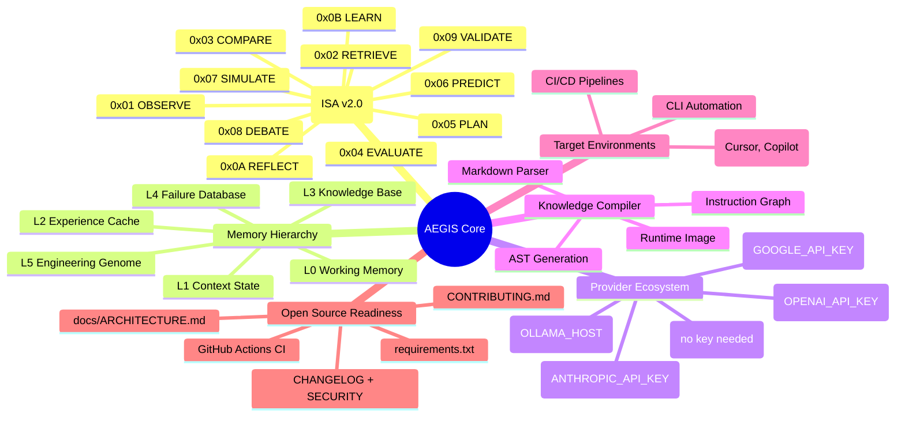

<!--
# ==========================================
# AEGIS COGNITIVE RUNTIME PLATFORM
# PROPRIETARY AND CONFIDENTIAL
# Copyright (c) 2024-2026 Wahyu Nur Iman.
# All rights reserved.
# ==========================================
-->
<div align="center">

[](https://github.com/wahyunuriman999/AEGIS-Core)
[]()
[]()
[](https://github.com/wahyunuriman999/AEGIS-Core/actions)
[]()

# AEGIS

### The Cognitive Runtime Platform for AI Engineering

*Engineering Intelligence Beyond the Language Model.*

[ [Architecture](#architecture) ] • [ [Installation](#installation) ] • [ [Usage](#usage) ] • [ [Tests](#tests) ] • [ [Contributing](#contributing) ] • [ [AEGIS Elite](#aegis-elite) ] • [ [FAQ](#faq) ]

</div>

---

## What is AEGIS?

**CORE PHILOSOPHY & BOUNDARIES:**
- **AEGIS Core** is strictly an **AI Engineering Engine**. It is the foundational, open-source engine. No matter how advanced it gets, it must never deviate from being the core engine mechanism.
- **AEGIS Elite** is the **AI Engineering Operating Platform**. It sits on top of the Core and is an open, full-fledged platform ready for extensive modifications, workflow orchestrations, and enterprise features.

AEGIS is a cognitive runtime layer that sits between the user and a language model. Instead of sending raw prompts, AEGIS structures reasoning into a formal pipeline — with planning, simulation, validation, and reflection — before any output is produced.

Language models are powerful, but they have no native scheduler, no memory hierarchy, and no way to enforce deterministic behavior. AEGIS adds that infrastructure.

---


### Product Map: AEGIS Core Ecosystem


```mermaid
mindmap
  root((AEGIS Core))
    Cognitive Pipeline (ISA v2.0)
      0x01 OBSERVE
      0x02 RETRIEVE
      0x03 COMPARE
      0x04 EVALUATE
      0x05 PLAN
      0x06 PREDICT
      0x07 SIMULATE
      0x08 DEBATE
      0x09 VALIDATE
      0x0A REFLECT
      0x0B LEARN
    Memory Hierarchy
      L0 Working Memory
      L1 Context State
      L2 Experience Cache
      L3 Knowledge Base
      L4 Failure Database
      L5 Engineering Genome
    Provider Ecosystem
      OpenAI (OPENAI_API_KEY)
      Anthropic (ANTHROPIC_API_KEY)
      Google Gemini (GOOGLE_API_KEY)
      Local Ollama (OLLAMA_HOST)
      Simulation (no key needed)
    Knowledge Compiler
      Markdown Parser
      AST Generation
      Instruction Graph
      Runtime Image
    Target Environments
      CLI Automation
      IDE Integrations (Cursor, Copilot)
      CI/CD Pipelines
    Open Source Readiness
      requirements.txt
      CONTRIBUTING.md
      GitHub Actions CI
      CHANGELOG + SECURITY
      docs/ARCHITECTURE.md
```

---

## Architecture

AEGIS is divided into focused subsystems:

### Runtime Pipeline

```
User Intent → Planner → Scheduler → Knowledge + Genome
                                          ↓
                               Simulation → Validation
                                          ↓
                               Reflection → Memory Update → Output
```

### Kernel

Manages the lifecycle of the reasoning process.

```
Boot → Clock → Scheduler → Dispatcher → Memory → Instruction → Event Bus → Runtime Ready
```

### Memory Hierarchy

Modeled after CPU cache layers:

| Layer | Name | Contents |
|-------|------|----------|
| L1 | Working Memory | Active task context |
| L2 | Context Memory | Broader project state |
| L3 | Knowledge Memory | Engineering rules and patterns |
| L4 | Experience Memory | Past failures and successes |
| L5 | Evolution Memory | The Engineering Genome |

### Knowledge Compiler

Converts documentation and guidelines into structured runtime graphs, rather than raw prompt text.

```
Markdown → Parser → AST → Knowledge Graph → Instruction Graph → Execution Graph → Runtime Image
```

### Cognitive Instruction Set (ISA v2.0)

AEGIS executes reasoning through strict opcodes, not freeform prompts:

| Opcode | Name | Description |
|--------|------|-------------|
| `0x01` | OBSERVE | Parse user intent, load context to L1 |
| `0x02` | RETRIEVE | Fetch relevant nodes from L3 Knowledge Graph |
| `0x03` | COMPARE | Cross-reference against PRECEDENCE.md rules |
| `0x04` | EVALUATE | Calculate Engineering Entropy score |
| `0x05` | PLAN | Invoke Provider to construct execution DAG |
| `0x06` | PREDICT | Simulate T+60 entropy forecast |
| `0x07` | SIMULATE | Stress-test plan against failure vectors |
| `0x08` | DEBATE | Invoke virtual sub-agents for consensus |
| `0x09` | VALIDATE | Verify consensus and entropy thresholds |
| `0x0A` | REFLECT | Compare output against FAILURE_DB patterns |
| `0x0B` | LEARN | Mutate genome, cache state to L4 memory |

### Provider Layer

AEGIS auto-detects available LLM providers from environment variables and routes each capability to the best available model. No API key? It runs in **Simulation mode** — no external calls required.

```
Cognitive Runtime → Provider Manager → Auto-detect env vars
                                              │
                    ┌─────────────────────────┼──────────────────────────┐
                    ▼                         ▼                          ▼
            OPENAI_API_KEY           ANTHROPIC_API_KEY           GOOGLE_API_KEY
             (GPT-4o)                 (Claude Sonnet)            (Gemini Flash)
                    │                                                     │
                    └──────────────── OLLAMA_HOST ────────────────────────┘
                                      (local Llama3)
                                            │
                                    [No keys? Simulation]
```

```bash
# Use OpenAI
export OPENAI_API_KEY="sk-..."

# Use Anthropic Claude
export ANTHROPIC_API_KEY="sk-ant-..."

# Use Google Gemini
export GOOGLE_API_KEY="AIza..."

# Use local Ollama
export OLLAMA_HOST="http://localhost:11434"

# No keys — runs in simulation mode automatically
python aegis/AEGIS-Runtime/kernel_runner.py --task "my task"
```

---

## Current Capabilities

What is actually running today:

**1. Full 11-Tick ISA Pipeline**
AEGIS executes a complete Cognitive Instruction Set (OBSERVE → RETRIEVE → COMPARE → EVALUATE → PLAN → PREDICT → SIMULATE → DEBATE → VALIDATE → REFLECT → LEARN) on every task.

**2. Real LLM Provider Routing**
Auto-detects OpenAI, Anthropic, Gemini, and Ollama from environment variables. Falls back to Simulation mode if no keys are set — pipeline always runs.

**3. Knowledge Compiler**
Compiles Markdown documentation into a structured runtime graph (`knowledge.graph.json`) that the kernel queries during RETRIEVE and COMPARE ticks.

**4. Cognitive Memory (L0–L5)**
Persists execution traces (`runtime_trace.json`), decision records (`decision_ledger.json`), and failure patterns (`FAILURE_DB.json`) across sessions.

**5. GitHub Actions CI**
Automated test suite runs on Python 3.10, 3.11, and 3.12 on every push and pull request.

---

## Installation

> [!WARNING]
> **Windows users:** If you see `Permission denied` during `git clone`, your terminal is probably opened in `C:\WINDOWS\System32`. Move to your user directory first (e.g., `cd $env:USERPROFILE\Documents`) before cloning.

### macOS / Linux

```bash
cd ~/Documents
git clone https://github.com/wahyunuriman999/AEGIS-Core.git
cd AEGIS-Core
pip install -r requirements.txt
python aegis/AEGIS-Runtime/kernel_runner.py --task "Hello AEGIS"
```

### Windows (PowerShell)

```powershell
cd $env:USERPROFILE\Documents
git clone https://github.com/wahyunuriman999/AEGIS-Core.git
cd AEGIS-Core
pip install -r requirements.txt
python aegis\AEGIS-Runtime\kernel_runner.py --task "Hello AEGIS"
```

> [!NOTE]
> No API key needed for first run — AEGIS auto-detects providers and falls back to Simulation mode.

---

## Usage

### Initialize a workspace

```bash
python AEGIS-Runtime/kernel_runner.py --init-workspace path/to/your/project
```

### Submit a task

```bash
python aegis/AEGIS-Runtime/kernel_runner.py --task "Refactor authentication module to use JWT and follow SOLID principles"
```

AEGIS runs the full **11-tick ISA pipeline** (OBSERVE → PLAN → SIMULATE → DEBATE → VALIDATE → LEARN) before producing output.

### Compile new knowledge

```bash
python aegis/AEGIS-Compiler/build.py
```

### View execution graph

```bash
python aegis/AEGIS-Runtime/kernel_runner.py --show-graph
```

---

## Tests

AEGIS is verified through Python unit tests and runs automated CI on GitHub Actions.

<div align="center">

[](https://github.com/wahyunuriman999/AEGIS-Core/actions)
[]()
[]()

</div>

### Run tests locally

```bash
pip install pytest
python -m pytest AEGIS-Tests/ -v
```

### Knowledge Compiler (`build.py`)

| Metric | Result | Status |
|--------|--------|--------|
| Output Artifacts | 3 Cognitive Graphs Generated | 🟢 PASSED |
| Integrity Check | Kernel Version Validated | 🟢 PASSED |
| Compilation Time | 505.98 ms | 🟢 PASSED |

### Cognitive Kernel (`kernel_runner.py`)

| Metric | Result | Status |
|--------|--------|--------|
| Memory Mounting | L0–L5 Memory Mounted | 🟢 PASSED |
| Provider Detection | Simulation mode (no keys) | 🟢 PASSED |
| Pipeline Execution | 11-Tick ISA Completed | 🟢 PASSED |
| Total Time | ~2.4 seconds | 🟢 PASSED |

<details>
<summary><b>View Raw Execution Log</b></summary>

```
[SYS] No API keys found — running in Simulation mode.
[SYS] Loaded 5 capabilities from Registry.
[BIOS: OK] Booting AEGIS Virtual Machine v12.0...
Mounting L0-L5 Memory Hierarchy...
[SYS] Validated ABI Conformity.
Kernel Version: v12.0.0-real-executable-kernel

--- [AEGIS] KERNEL DISPATCH: SPRINT 2 VERIFICATION ---
[Tick 0x01: OBSERVE]  -> Parsed user intent. Loaded to L1.
[Tick 0x02: RETRIEVE] -> Fetched compiled nodes from L3.
[Tick 0x03: COMPARE]  -> Cross-referenced against PRECEDENCE.md.
[Tick 0x04: EVALUATE] -> Entropy: Low, Latency: Optimal.
[Tick 0x05: PLAN]     -> [SIM] Synthesized capability 'core.planning'
[Tick 0x06: PREDICT]  -> T+60 Entropy Forecast: 22.60
[Tick 0x07: SIMULATE] -> Stress-tested against failure vectors.
[Tick 0x08: DEBATE]   -> Consensus reached across 3 agents.
[Tick 0x09: VALIDATE] -> Entropy acceptable.
[Tick 0x0A: REFLECT]  -> Compared against FAILURE_DB.
[Tick 0x0B: LEARN]    -> Genome mutated. Cached to L4.

[KERNEL] 11-Tick Pipeline Completed. Terminated in 2.41s.
```

</details>

---

## Core vs. Elite — Honest Comparison

AEGIS-Core is the foundation. AEGIS-Elite is the full operating system built on top of it. The table below shows the differences honestly, without exaggeration:

| Capability | AEGIS-Core | AEGIS-Elite |
|---|:---:|:---:|
| **Cognitive Runtime (4-tick pipeline)** | ✅ | ✅ |
| **Knowledge Compiler** | ✅ | ✅ |
| **Memory Hierarchy (L1–L5)** | ✅ | ✅ |
| **Provider routing** (GPT, Claude, Gemini, etc.) | ✅ | ✅ |
| **Governance** | 1 layer (basic) | **5 layers** (Architecture, Security, Maintainability, Performance, Compliance) |
| **Per-commit audit trail** | ❌ | ✅ |
| **Multi-agent consensus** | ❌ | ✅ 5 agents + veto power |
| **Risk analysis before changes** | ❌ | ✅ Blast-radius scoring |
| **Cross-session cognitive memory** | Basic (L4 Experience) | ✅ 4 subsystems (ADR ledger, topology diff, learning loop, trend analysis) |
| **Governance tightens from failures** | ❌ | ✅ LearningLoop auto-tightening |
| **Extension marketplace** | ❌ | ✅ 7 domain packs |
| **Verifiable benchmark suite** | ❌ | ✅ 6 metrics vs industry baseline |
| **Enterprise compliance** | ❌ | ✅ SOC2, GDPR, RBAC, audit trail |
| **Rapid Execution Partners** | ❌ | ✅ Native Appsmith, ILLA, Teable, Noodl |
| **Execution-First Rule** | ❌ | ✅ Invariant 10 (Anti-Boilerplate) |
| **Git pre-commit hook** | ❌ | ✅ |
| **Multi-step workflow with rollback** | ❌ | ✅ |
| **Learning curve** | ⭐⭐⭐⭐⭐ (easy) | ⭐⭐⭐ (steeper) |
| **Best for** | Open source, integration, learning | Large teams, enterprise, strict regulation |

### Why Core is better for some use cases

Core is intentionally lighter — and that is its strength:

- **Easier to learn** — no extra concepts to absorb before you start
- **Easier to integrate** — drops into Cursor, Copilot, Cline, Claude Code with no extra configuration
- **Lighter maintenance** — small codebase, easy to fork and contribute to
- **Faster boot** — no overhead from governance and consensus engines

Core is the right choice if you don't need all the enterprise layers that Elite provides.

---

## AEGIS Elite

For teams that need more than the foundation, there is a premium tier called **[AEGIS Elite](https://github.com/wahyunuriman999/AEGIS-ELITE)**.

Elite is not just Core with extra features. It is a complete engineering platform that uses Core as its kernel — the same way Ubuntu uses the Linux kernel as its foundation.

What Elite actually adds:
- 5-layer governance engine that blocks problematic commits before they enter the codebase
- 5-agent AI council that debates every change, with veto rights for security and architecture
- Cognitive memory system that learns from failures and tightens governance over time
- Risk assessment that calculates the blast radius of changes before execution
- Extension packs for specific domains (React, Flutter, Laravel, Rust, Security, ML, Python)
- Enterprise compliance (SOC2, GDPR, RBAC, audit trail)
- Native Rapid Execution Engines for Low-Code/No-Code platforms (Appsmith, ILLA Builder, Teable, Noodl)
- Invariant 10: Execution-First architecture for instant functional outputs (Anti-Boilerplate)

Interested in discussing your use case and pricing?
Contact: **wahyunuriman999@gmail.com**

GitHub Elite (Private Respo): [github.com/wahyunuriman999/AEGIS-ELITE](https://github.com/wahyunuriman999/AEGIS-ELITE)

---

## Contributing

We welcome contributions! Please read [`CONTRIBUTING.md`](./CONTRIBUTING.md) for:
- Development setup
- Code style (PEP 8, license headers)
- Commit message format (Conventional Commits)
- Architecture boundaries (what belongs in Core vs Elite)
- How to report bugs and request features

```bash
# Fork → clone → branch → commit → pull request
git checkout -b feat/your-feature
git commit -m "feat(kernel): add your feature"
```

For security vulnerabilities, see [`SECURITY.md`](./SECURITY.md).

---

## Repository Structure

```
AEGIS-Core/
├── .github/
│   ├── workflows/test.yml      # GitHub Actions CI (Python 3.10/3.11/3.12)
│   └── ISSUE_TEMPLATE/
├── AEGIS-Tests/
│   ├── test_aegis.py           # Unit test suite
│   └── benchmark_runner.py     # Performance benchmark
├── aegis/
│   ├── AEGIS-Kernel/           # Boot, clock, scheduler, memory, ISA
│   ├── AEGIS-Runtime/          # kernel_runner.py — 11-tick pipeline
│   ├── AEGIS-Compiler/         # build.py — Markdown → Runtime Graph
│   ├── AEGIS-Provider/         # provider_manager.py — LLM routing
│   ├── AEGIS-Specification/    # ABI spec, capability registry
│   └── AEGIS-Knowledge/        # Knowledge packs
├── docs/
│   └── ARCHITECTURE.md         # Full architecture reference
├── requirements.txt            # pip install -r requirements.txt
├── CONTRIBUTING.md             # Contribution guide
├── CHANGELOG.md                # Version history
├── SECURITY.md                 # Vulnerability reporting
├── install.sh / install.ps1    # Cross-platform installers
└── README.md                   # This file
```

---

## Choosing Core or Elite

This is not about which is "better" in absolute terms. It is about what you need.

**Choose Core if:**
- You want to understand and experiment with AEGIS
- Your team is small (1–5 developers)
- You want to integrate AEGIS into an existing toolchain
- Open source and community contribution are priorities

**Choose Elite if:**
- Your team has 5+ developers with code standards that need centralized enforcement
- You need auditability and governance for regulatory compliance
- You need automated workflows from requirement through deployment
- Every commit must pass layered validation before reaching production

---

## FAQ

**Why not just use GPT or Claude directly?**
Language models predict tokens. AEGIS controls *how* and *when* they predict tokens — using a formal scheduler, reflection loop, and simulation layer. The LLM is the compute, not the brain.

**Why not use LangChain or CrewAI?**
Those are workflow and agent frameworks. AEGIS operates at a lower layer — it defines the Instruction Set, Memory Hierarchy, and Execution Graph that those frameworks would sit on top of.

**Why compile knowledge instead of including it in prompts?**
Sending thousands of lines of markdown into a prompt introduces noise and non-determinism. Compiling it into a graph ensures the runtime has a structured, queryable knowledge base.

---

<div align="center">

**AEGIS** — *Engineering Intelligence Beyond the Language Model.*

Copyright © 2024–2026 Wahyu Nur Iman. All rights reserved. Proprietary and Confidential.

</div>
