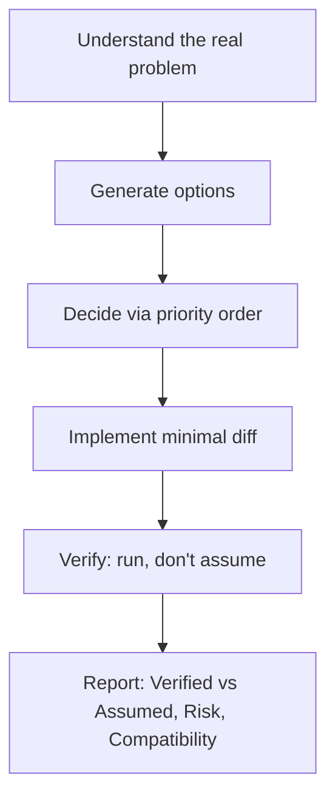

# Foundation Flow (Mermaid)

```mermaid
graph TD;
  A[Understand the real problem] --> B[Generate options];
  B --> C[Decide via priority order];
  C --> D[Implement minimal diff];
  D --> E[Verify: run, don't assume];
  E --> F[Report: Verified vs Assumed, Risk, Compatibility];
```
